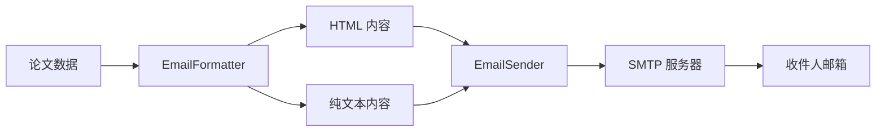

# OpenResourceRepo/SamArM 邮件发送模块详细说明

## 📁 模块概述

SamArM 项目的邮件发送功能位于 `OpenResourceRepo/SamArM/src/sender/` 目录下,主要负责将 Arxiv 论文数据格式化为精美的 HTML 邮件并发送给订阅用户。

## 📂 代码位置与文件结构

```
OpenResourceRepo/SamArM/src/sender/
├── __init__.py              # 模块导出文件
├── email_sender.py          # 邮件发送核心类
├── email_formatter.py       # 邮件格式化器
└── email_templates.py       # HTML 邮件模板
```

---

## 🔧 核心组件详解

### 1. **EmailSender** - 邮件发送器

**文件位置**: [`email_sender.py`](file:///Users/mac/Desktop/AS/OpenResourceRepo/SamArM/src/sender/email_sender.py)

#### 主要功能
- 通过 SMTP 协议发送邮件
- 支持 SSL/TLS 加密连接
- 自动重试机制
- 批量发送邮件

#### 核心方法

##### `__init__(smtp_config: Dict[str, any])`
**功能**: 初始化邮件发送器

**参数**:
```python
smtp_config = {
    'sender_email': str,        # 发送者邮箱
    'sender_password': str,     # 发送者密码/授权码
    'smtp_server': str,         # SMTP服务器地址
    'smtp_port': int,           # SMTP端口（465=SSL，587=STARTTLS）
    'use_tls': bool,            # 是否使用STARTTLS（默认True）
    'use_ssl': bool,            # 是否使用SSL（默认当端口为465时开启）
    'timeout': int,             # 连接超时（秒）
    'max_retries': int          # 默认重试次数（默认=1）
}
```

**代码位置**: [L20-L53](file:///Users/mac/Desktop/AS/OpenResourceRepo/SamArM/src/sender/email_sender.py#L20-L53)

---

##### `send_email(to_email, subject, html_content, plain_content, max_retries)`
**功能**: 发送单封邮件

**参数**:
- `to_email` (str): 收件人邮箱
- `subject` (str): 邮件主题
- `html_content` (str): HTML 内容
- `plain_content` (Optional[str]): 纯文本内容（备选）
- `max_retries` (Optional[int]): 最大重试次数

**返回值**: `Tuple[bool, str]` - (是否成功, 消息)

**代码位置**: [L74-L150](file:///Users/mac/Desktop/AS/OpenResourceRepo/SamArM/src/sender/email_sender.py#L74-L150)

**核心逻辑**:
1. 创建 MIME 多部分邮件消息
2. 根据配置选择 SMTP_SSL 或 SMTP 客户端
3. 连接服务器并进行身份验证
4. 发送邮件
5. 失败时自动重试（带指数退避）

**异常处理**:
- `SMTPAuthenticationError`: SMTP 认证失败
- `SMTPServerDisconnected`: 服务器断开连接
- `SMTPException`: 其他 SMTP 错误

---

##### `send_batch_emails(recipients, subject, html_content, plain_content, delay, max_retries)`
**功能**: 批量发送邮件

**参数**:
- `recipients` (List[str]): 收件人列表
- `subject` (str): 邮件主题
- `html_content` (str): HTML 内容
- `plain_content` (Optional[str]): 纯文本内容
- `delay` (float): 每封邮件间隔（秒，默认1.0）
- `max_retries` (Optional[int]): 每封邮件的重试次数

**返回值**: 
```python
{
    'total': int,                    # 总数
    'success': int,                  # 成功数
    'failed': int,                   # 失败数
    'failed_recipients': List[str],  # 失败的收件人列表
    'failed_reasons': Dict[str, str] # 失败原因映射
}
```

**代码位置**: [L152-L199](file:///Users/mac/Desktop/AS/OpenResourceRepo/SamArM/src/sender/email_sender.py#L152-L199)

---

### 2. **EmailFormatter** - 邮件格式化器

**文件位置**: [`email_formatter.py`](file:///Users/mac/Desktop/AS/OpenResourceRepo/SamArM/src/sender/email_formatter.py)

#### 主要功能
- 将论文数据转换为 HTML 邮件
- 生成纯文本备选邮件
- 计算统计信息

#### 核心方法

##### `sort_papers_by_relevance(papers: List[Dict]) -> List[Dict]`
**功能**: 按相关性分数排序论文

**代码位置**: [L22-L33](file:///Users/mac/Desktop/AS/OpenResourceRepo/SamArM/src/sender/email_formatter.py#L22-L33)

---

##### `get_topic_statistics(papers: List[Dict]) -> Dict[str, int]`
**功能**: 获取主题统计信息

**返回值**: `{'topic_name': count, ...}`

**代码位置**: [L35-L50](file:///Users/mac/Desktop/AS/OpenResourceRepo/SamArM/src/sender/email_formatter.py#L35-L50)

---

##### `format_papers_to_html(papers: List[Dict]) -> Tuple[str, Dict]`
**功能**: 将论文列表格式化为 HTML 邮件内容

**返回值**: 
```python
(
    html_content: str,  # HTML 内容
    stats: {
        'total_papers': int,
        'topic_stats': Dict[str, int],
        'avg_relevance_score': float,
        'generated_at': str
    }
)
```

**代码位置**: [L52-L82](file:///Users/mac/Desktop/AS/OpenResourceRepo/SamArM/src/sender/email_formatter.py#L52-L82)

---

##### `generate_plain_text_email(papers: List[Dict]) -> str`
**功能**: 生成纯文本邮件（备选方案）

**代码位置**: [L84-L140](file:///Users/mac/Desktop/AS/OpenResourceRepo/SamArM/src/sender/email_formatter.py#L84-L140)

---

### 3. **EmailTemplate** - HTML 邮件模板

**文件位置**: [`email_templates.py`](file:///Users/mac/Desktop/AS/OpenResourceRepo/SamArM/src/sender/email_templates.py)

#### 主要功能
- 定义精美的 HTML 邮件样式
- 生成论文卡片
- 支持五维度质量评分展示

#### 核心方法

##### `get_header(date_str, total_papers, topic_stats) -> str`
**功能**: 生成邮件头部 HTML

**代码位置**: [L12-L339](file:///Users/mac/Desktop/AS/OpenResourceRepo/SamArM/src/sender/email_templates.py#L12-L339)

**样式特点**:
- 渐变色头部背景 (`#667eea` → `#764ba2`)
- 响应式设计（移动端适配）
- 信息卡片展示统计数据

---

##### `get_paper_card(index: int, paper: dict) -> str`
**功能**: 生成单篇论文的卡片 HTML

**论文数据结构**:
```python
paper = {
    'title': str,                    # 论文标题
    'authors': List[str],            # 作者列表
    'published': str,                # 发布日期
    'topic_category': str,           # 主题分类
    'relevance_score': float,        # 相关性分数
    'ai_summary': str,               # AI 总结
    'arxiv_url': str,                # Arxiv 链接
    'paper_id': str,                 # 论文 ID
    'matched_keywords': List[str],   # 匹配的关键词
    
    # 质量评估字段（可选）
    'quality_score': float,          # 综合质量分数 (0-10)
    'quality_level': str,            # 质量等级
    'quality_reasoning': str,        # 评估理由
    'innovation_score': float,       # 创新性 (0-10)
    'practicality_score': float,     # 实用性 (0-10)
    'technical_depth_score': float,  # 技术深度 (0-10)
    'experimental_rigor_score': float, # 实验完整性 (0-10)
    'impact_potential_score': float, # 影响力潜力 (0-10)
    'strengths': List[str],          # 优点列表
    'weaknesses': List[str]          # 不足列表
}
```

**代码位置**: [L341-L545](file:///Users/mac/Desktop/AS/OpenResourceRepo/SamArM/src/sender/email_templates.py#L341-L545)

**卡片特性**:
- 悬停效果（阴影 + 边框高亮）
- 主题标签（带 emoji 图标）
- 相关性分数徽章
- 质量评分徽章（🏆⭐✅📝📄）
- 五维度雷达图（文本版）
- AI 评估理由
- 优点/不足列表

---

##### `get_footer() -> str`
**功能**: 生成邮件底部 HTML

**代码位置**: [L547-L573](file:///Users/mac/Desktop/AS/OpenResourceRepo/SamArM/src/sender/email_templates.py#L547-L573)

---

##### `generate_email_html(papers: list, topic_stats: dict) -> str`
**功能**: 生成完整的邮件 HTML

**代码位置**: [L575-L596](file:///Users/mac/Desktop/AS/OpenResourceRepo/SamArM/src/sender/email_templates.py#L575-L596)

---

## 🔄 完整工作流程

### 在 `daily_job.py` 中的使用

**文件位置**: [`daily_job.py`](file:///Users/mac/Desktop/AS/OpenResourceRepo/SamArM/src/pipeline/daily_job.py)

**流程图**:
```
爬取论文 → 去重 → 筛选 → AI总结 → 质量评估 → 邮件格式化 → 邮件发送 → 落盘
```

**关键代码段**:

```python
# 步骤 9: 格式化邮件 (L188-L191)
formatter = EmailFormatter()
html, email_stats = formatter.format_papers_to_html(final_papers)
plain = formatter.generate_plain_text_email(final_papers)

# 步骤 10: 发送邮件 (L195-L206)
if send_email:
    email_config = self.cm.get_email_config()
    recipients = email_config.get('recipients', [])
    if recipients and email_config.get('sender_email'):
        sender = EmailSender(email_config)
        subject = f"【Arxiv论文日报】{datetime.utcnow().strftime('%Y-%m-%d')}"
        sent_stats = sender.send_batch_emails(recipients, subject, html, plain)
```

**代码位置**: [L188-L206](file:///Users/mac/Desktop/AS/OpenResourceRepo/SamArM/src/pipeline/daily_job.py#L188-L206)

---

## 🧪 测试文件

**文件位置**: [`test_sender.py`](file:///Users/mac/Desktop/AS/OpenResourceRepo/SamArM/test_sender.py)

**测试流程**:
1. 爬取 Arxiv 论文（3天内）
2. 去重处理
3. 论文筛选与分类
4. AI 核心思想提取
5. 邮件格式化
6. 邮件发送（需用户确认）

**运行方式**:
```bash
cd OpenResourceRepo/SamArM
python test_sender.py
```

**关键测试点**:
- 合并论文元数据（主题分类、相关性分数）
- HTML 和纯文本邮件生成
- 批量邮件发送（重试次数=1）

**代码位置**: [L63-L128](file:///Users/mac/Desktop/AS/OpenResourceRepo/SamArM/test_sender.py#L63-L128)

---

## ⚙️ 配置要求

### 环境变量（`.env` 文件）

```env
# SMTP 配置
SENDER_EMAIL=your_email@example.com
SENDER_PASSWORD=your_authorization_code
SMTP_SERVER=smtp.example.com
SMTP_PORT=587

# 收件人（用 | 分隔）
RECIPIENT_EMAILS=user1@example.com|user2@example.com
```

### 常见 SMTP 配置

| 邮箱服务商 | SMTP 服务器 | 端口 | 说明 |
|-----------|------------|------|------|
| QQ 邮箱 | `smtp.qq.com` | 465 (SSL) / 587 (TLS) | 需启用 SMTP 并使用授权码 |
| 163 邮箱 | `smtp.163.com` | 465 (SSL) / 25 (非加密) | 需启用 SMTP 服务 |
| Gmail | `smtp.gmail.com` | 587 (TLS) | 需启用"不够安全的应用"或使用应用专用密码 |
| Outlook | `smtp-mail.outlook.com` | 587 (TLS) | 使用账号密码 |

---

## 🎨 邮件样式特点

### 视觉设计
- **配色方案**: 紫色渐变主题（`#667eea` → `#764ba2`）
- **字体**: 系统默认字体栈（Apple/Segoe UI/Roboto）
- **响应式**: 支持移动端自适应

### 信息展示
1. **头部**: 日期 + 论文总数 + 主题分布
2. **论文卡片**:
   - 标题（可点击跳转）
   - 作者、发布日期、论文 ID
   - 主题标签 + 相关性分数 + 质量徽章
   - 五维度评分（创新性、实用性、技术深度、实验完整性、影响力潜力）
   - AI 核心思想总结
   - AI 评估理由
   - 优点/不足列表
   - 关键词
   - 查看原文按钮
3. **底部**: 项目信息 + 反馈链接

### 主题标签支持
- 🖼️ 图像去噪 (`image_denoising`)
- 🌧️ 图像去雨 (`image_deraining`)
- 🎨 图像生成 (`image_generation`)
- 🌊 扩散模型 (`diffusion_models`)
- 🗣️ 大语言模型 (`large_language_models`)
- 🎭 多模态大模型 (`multimodal_large_models`)
- 🏗️ 模型架构 (`model_architecture`)
- 🔶 Transformer (`transformer_architecture`)
- 🤖 强化学习 (`reinforcement_learning`)
- 🦾 具身智能 (`embodied_ai`)
- 🌍 世界模型 (`world_models`)
- 📐 3D 视觉 (`3d_vision`)
- 🎬 视频理解 (`video_understanding`)
- 👁️ 计算机视觉 (`computer_vision`)
- 🧠 深度学习 (`deep_learning`)

---

## 🔍 关键技术点

### 1. SMTP 连接策略
- **SSL 模式** (端口 465): 使用 `smtplib.SMTP_SSL`
- **STARTTLS 模式** (端口 587): 使用 `smtplib.SMTP` + `starttls()`

### 2. 重试机制
- 默认重试 1 次（可配置）
- 指数退避策略（等待时间 = 尝试次数）
- 区分认证错误（不重试）和网络错误（重试）

### 3. 邮件格式
- **MIME Multipart**: 同时包含 HTML 和纯文本
- **字符编码**: UTF-8
- **发件人显示**: `Arxiv Mailbot <sender@example.com>`

### 4. 批量发送优化
- 邮件间隔（默认 1 秒）防止被识别为垃圾邮件
- 详细的失败统计和原因记录

---

## 📊 数据流转



---

## 🚨 常见问题

### 1. SMTP 认证失败
**原因**: 
- QQ 邮箱未启用 SMTP 服务
- 使用密码而非授权码

**解决**: 
- 登录邮箱设置 → 账户 → 开启 SMTP 服务
- 使用生成的授权码替代密码

### 2. 连接超时
**原因**: 
- 网络问题
- SMTP 服务器地址/端口错误

**解决**: 
- 检查网络连接
- 验证 SMTP 配置是否正确

### 3. 邮件进入垃圾箱
**原因**: 
- 发送频率过高
- 邮件内容触发垃圾邮件过滤器

**解决**: 
- 增加 `delay` 参数（邮件间隔）
- 优化邮件内容和主题

---

## 📝 总结

SamArM 的邮件发送模块是一个**功能完善、设计精美**的邮件系统，具备以下特点：

✅ **模块化设计**: 发送器、格式化器、模板三者分离  
✅ **健壮性**: 完善的异常处理和重试机制  
✅ **美观性**: 现代化的 HTML 邮件设计  
✅ **可扩展性**: 支持质量评估、五维度评分等高级功能  
✅ **易用性**: 简洁的 API 和详细的文档  

**核心文件**:
- [`email_sender.py`](file:///Users/mac/Desktop/AS/OpenResourceRepo/SamArM/src/sender/email_sender.py) - 邮件发送逻辑
- [`email_formatter.py`](file:///Users/mac/Desktop/AS/OpenResourceRepo/SamArM/src/sender/email_formatter.py) - 数据格式化
- [`email_templates.py`](file:///Users/mac/Desktop/AS/OpenResourceRepo/SamArM/src/sender/email_templates.py) - HTML 模板

**使用示例**: [`daily_job.py`](file:///Users/mac/Desktop/AS/OpenResourceRepo/SamArM/src/pipeline/daily_job.py) | [`test_sender.py`](file:///Users/mac/Desktop/AS/OpenResourceRepo/SamArM/test_sender.py)
