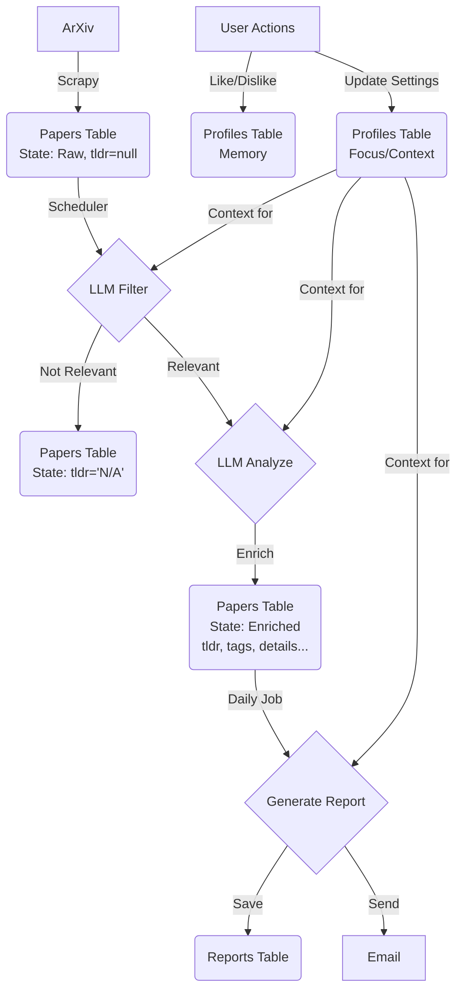

# 系统执行逻辑与数据流转报告

本文档详细说明了 Paper Scout Agent 的核心代码执行逻辑、数据流动过程以及各阶段数据的存储位置。

## 1. 核心执行逻辑概览

系统的核心是由 `SchedulerService` (`backend/scheduler.py`) 驱动的自动化工作流，主要包含三个阶段：

1.  **数据采集 (Crawl)**: 定时触发爬虫从 ArXiv 获取最新论文。
2.  **智能处理 (Process)**: 对新入库的论文进行初筛（Filter）和深度分析（Analyze）。
3.  **研报生成 (Report)**: 每日聚合高质量论文生成研报并发送邮件。

---

## 2. 数据流动与存储详解

### 2.1 论文列表 (原始数据)
- **来源**: `ArxivSpider` (`backend/spiders/arxiv.py`)。
- **触发**: 定时任务或手动触发 `scrapy crawl arxiv`。
- **存储位置**: Supabase 数据库的 `papers` 表。
- **数据状态**: 
    - 包含基础元数据：`title`, `authors`, `abstract`, `category`, `link` 等。
    - **关键特征**: 此时 `tldr` 字段为空 (NULL 或 "")，表示“未处理”。

### 2.2 初筛后的论文 (Filtering)
- **执行者**: `SchedulerService.process_new_papers` 调用 `LLMService.filter_paper`。
- **逻辑**: 将论文的 `title` 和 `abstract` 与用户的 `UserProfile` (关注领域) 进行比对。
- **存储位置**: 依然存储在 `papers` 表中，通过更新字段状态来区分。
- **数据流向**:
    - **不相关**: 
        - `suggestion` 字段更新为 "Not Relevant: [原因]"。
        - `tldr` 字段更新为 "N/A" (标记为已处理但无需展示)。
        - **结果**: 该论文在前端会被过滤，不会进入后续分析流程。
    - **相关**: 
        - 进入下一阶段（深度分析）。

### 2.3 评价后的论文 (Analysis)
- **执行者**: `SchedulerService.process_new_papers` 调用 `LLMService.analyze_paper`。
- **逻辑**: 对通过初筛的论文，调用 LLM 生成深度分析内容。
- **存储位置**: `papers` 表 (原地更新)。
- **新增数据**:
    - `tldr`: 一句话总结 (覆盖原本的空值)。
    - `suggestion`: 推荐理由 (覆盖原本的空值)。
    - `tags`: 自动生成的标签列表。
    - `details`: JSON 字段，追加 `motivation` (动机), `method` (方法), `result` (结果), `conclusion` (结论)。
- **结果**: 这些论文会在前端 "Paper List" 中展示，并带有 "Analysis" 按钮。

### 2.4 报告 (Reports)
- **执行者**: `SchedulerService.generate_report_job` 调用 `ReportService.generate_daily_report`。
- **逻辑**: 
    1. 查询 `papers` 表中所有 `tldr` 不为 "N/A" 且日期为当天的论文。
    2. 将这些论文的摘要聚合，发送给 LLM 生成综述。
- **存储位置**: Supabase 数据库的 `reports` 表。
- **数据结构**:
    - `id`: UUID。
    - `title`: 研报标题 (如 "2025/11/22 Daily AI Report")。
    - `summary`: 研报总摘要。
    - `content`: 结构化的研报内容 (JSON)。
    - `user_id`: 关联的用户 ID。
- **后续动作**: 生成后会立即调用 `EmailSender` 发送 HTML 邮件。

### 2.5 用户个性化数据 (User Profile)
- **执行者**: `UserService` (`backend/services/user_service.py`)。
- **存储位置**: Supabase 数据库的 `profiles` 表。
- **数据结构**:
    - **Info (`info`)**: 基础信息 (姓名, 邮箱, 昵称)。
    - **Focus (`focus`)**: 关注点 (JSON)，包含 `keywords` (关键词), `domains` (领域)。这是 LLM 进行初筛和分析的核心依据。
    - **Memory (`memory`)**: 记忆模块 (JSON)，包含：
        - `readPapers`: 用户点过 "Like" 或已读的论文 ID 列表。
        - `dislikedPapers`: 用户点过 "Dislike" 的论文 ID 列表。
    - **Context (`context`)**: 当前上下文 (JSON)，如 `currentTask` (当前任务), `learningMode` (学习模式)。

## 3. 总结图示

